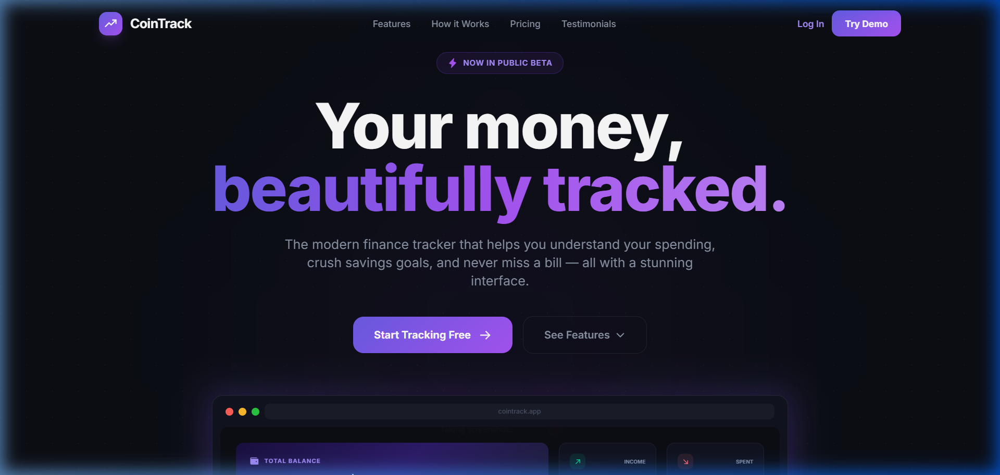
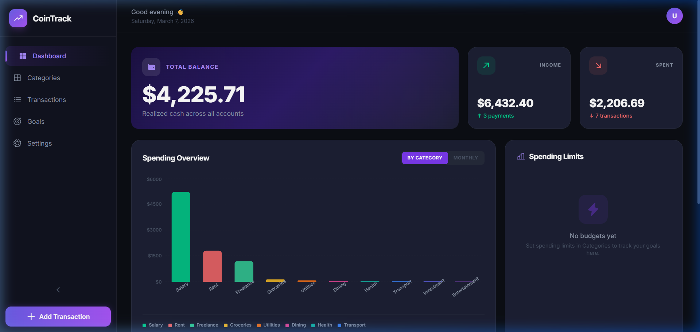
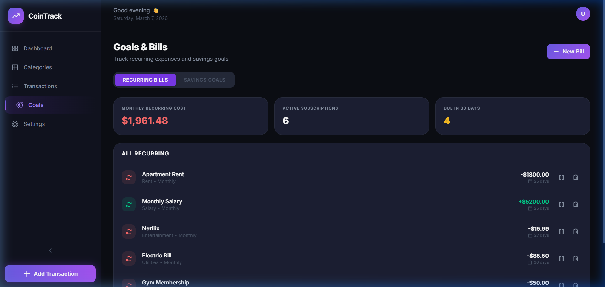
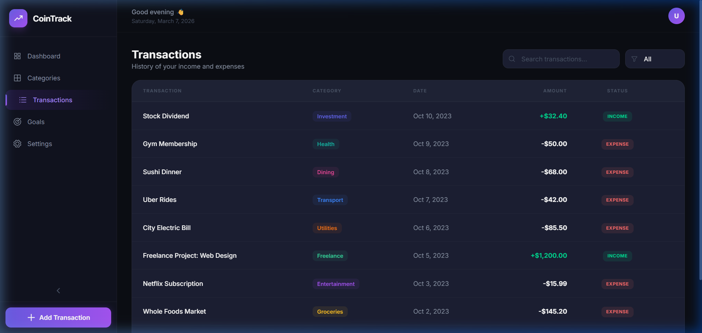

# CoinTrack — Smart Finance Tracker

> A modern, enterprise-grade personal finance SaaS built with React, TypeScript, and Node.js.



## ✨ Features

- 📊 **Smart Analytics** — Interactive spending charts by category & monthly trends
- 🔄 **Recurring Tracker** — Track subscriptions, bills, and recurring income with due-date alerts
- 🎯 **Savings Goals** — Set targets with visual progress bars and contribute over time
- 📂 **Category Management** — Custom categories with budget limits
- 💸 **Transaction History** — Full CRUD with search, filters, and pagination
- ⚙️ **Settings** — Profile, appearance, currency, data export (CSV/JSON)
- 🌙 **Dark Mode** — Premium dark UI with purple gradients and glassmorphism
- 📱 **Fully Responsive** — Desktop, tablet, and mobile
- 🚀 **Landing Page** — Marketing page with scroll animations, pricing tiers, and testimonials

## 🛠 Tech Stack

| Layer | Technology |
|-------|-----------|
| Frontend | React 19, TypeScript, Tailwind CSS |
| Charts | Recharts |
| Icons | Phosphor React |
| Backend | Node.js, Express.js |
| Database | SQLite (sql.js) |
| Build Tool | Vite |
| Dev Tools | Concurrently, Node --watch |

## 🚀 Getting Started

### Prerequisites

- Node.js 18+
- npm

### Installation

```bash
# Clone the repo
git clone https://github.com/YOUR_USERNAME/cointrack.git
cd cointrack

# Install frontend dependencies
npm install

# Install backend dependencies
cd server && npm install && cd ..
```

### Running Locally

```bash
npm run dev:all
```

This starts both the Vite dev server (port 3000) and the Express API (port 3001) concurrently.

Open **http://localhost:3000** to view the app.

## 📸 Screenshots

<details>
<summary>Click to expand</summary>

### Landing Page


### Dashboard


### Goals & Bills


### Transactions


</details>

## 📁 Project Structure

```
cointrack/
├── components/          # React components
│   ├── LandingPage.tsx  # Marketing landing page
│   ├── Dashboard.tsx    # Main dashboard with charts
│   ├── Transactions.tsx # Transaction management
│   ├── Categories.tsx   # Category & budget management
│   ├── Goals.tsx        # Recurring bills & savings goals
│   ├── Settings.tsx     # User preferences
│   ├── Layout.tsx       # App shell with sidebar
│   └── ...
├── server/
│   ├── index.js         # Express API server
│   └── db.js            # SQLite database setup
├── App.tsx              # Root component & state management
├── types.ts             # TypeScript interfaces
├── index.css            # Design system & global styles
└── vite.config.ts       # Vite configuration with API proxy
```

## 🔑 API Endpoints

| Method | Endpoint | Description |
|--------|----------|-------------|
| GET | `/api/transactions` | List all transactions |
| POST | `/api/transactions` | Create transaction |
| DELETE | `/api/transactions/:id` | Delete transaction |
| GET | `/api/categories` | List categories |
| POST | `/api/categories` | Create category |
| GET | `/api/budgets` | List budget limits |
| PUT | `/api/budgets/:name` | Update budget |
| GET | `/api/recurring` | List recurring bills |
| POST | `/api/recurring` | Create recurring bill |
| PATCH | `/api/recurring/:id/toggle` | Pause/resume bill |
| DELETE | `/api/recurring/:id` | Delete recurring bill |
| GET | `/api/goals` | List savings goals |
| POST | `/api/goals` | Create goal |
| PATCH | `/api/goals/:id/contribute` | Add contribution |
| DELETE | `/api/goals/:id` | Delete goal |

## 📄 License

MIT © 2026
